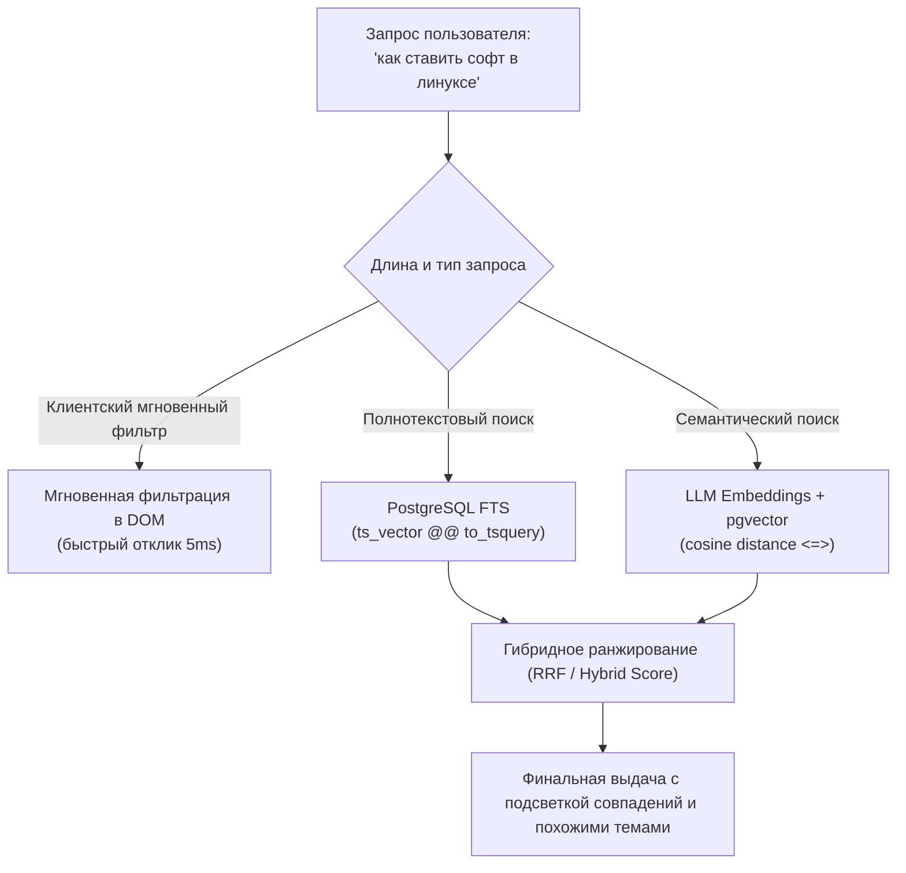

# Эксперимент «Суперсправочник» (`notes`) — Архитектурный план

План эксперимента **«Суперсправочник»**: персональный интеллектуальный хаб для хранения заметок, полезных ссылок, сниппетов, инструкций и структурированных иерархических подборок с гибридным полнотекстовым и семантическим поиском на базе **PostgreSQL** и **pgvector**.

Статус: **проектирование**. Эксперимент расширяет экосистему Vesha (`docs/experiments.md`), дополняя радары персональным рабочим пространством пользователя.

---

## 1. Зачем и для кого: концепция «Быстрый захват + Умное извлечение»

Боль большинства систем заметок (Notion, Obsidian, закладки браузера):
1. **Закладки браузера** — плоские, слепые, забываются на следующий день; невозможно прикрепить контекст или сгруппировать 4 альтернативных утилиты под одним описанием.
2. **Тяжелые базы знаний (Notion)** — слишком медленный ввод: чтобы сохранить полезную ссылку с тремя комментариями, нужно создать страницу, выбрать шаблон, расставить свойства.
3. **Блокноты (Apple Notes / Google Keep)** — быстро превращаются в «свалку», в которой через полгода невозможно найти информацию, если забыл точное слово, использованное в заголовке.

**«Суперсправочник» решает две ключевые задачи:**
* **Быстрый захват (Quick Capture)**: сохранить ссылку, мысль или ветвистый список за 3 секунды с минимальным числом кликов.
* **Смысловое извлечение (Semantic Retrieval)**: найти сохраненное спустя год, даже если запрос сформулирован совершенно другими словами (например, поиск «*магазины софта в линукс*» мгновенно находит заметку с утилитами `flatpak` и `plasma-discover`).

---

## 2. Иерархичность и группировка данных

### Проблема одиночных заметок
Часто единица знания — это не одна ссылка и не один абзац текста, а **связанная подборка (кластер альтернатив или шагов)**.
*Пример*: пользователь искал популярные менеджеры пакетов / магазины приложений для Linux и нашел 4 решения:
* `plasma-discover` — графический центр приложений KDE;
* `stplr` — CLI-утилита управления пакетами;
* `apm` — менеджер пакетов Atom/утилит;
* `flatpak` — универсальная система дистрибуции песочниц.

Хранить это 4 отдельными заметками — замусорить базу. Хранить плоским сплошным текстом — теряется интерактивность (нельзя быстро кликнуть, скопировать команду установки, свернуть/развернуть).

### Решение: Композитная структура «Корень + Вложенные узлы»

Мы поддерживаем два взаимодополняющих формата представления:

#### А. Нативный визуальный UI: Аккордеоны и раскрывающиеся деревья (`<details>` / `<summary>`)
В интерфейсе заметка отображается как интерактивная карточка:
* **Заголовок корня**: *«Менеджеры пакетов и центры приложений Linux»*
* **Описание/Контекст**: *«Утилиты для поиска и установки GUI/CLI софта без привязки к конкретному дистрибутиву»*
* **Интерактивный сворачивающийся список**:
  ```html
  <details open class="note-tree">
    <summary class="tree-root">Найдено 4 решения</summary>
    <ul class="tree-items">
      <li class="tree-item">
        <a href="https://userbase.kde.org/Discover" target="_blank" class="item-link">plasma-discover</a>
        <span class="item-desc">Графический магазин приложений KDE с поддержкой Flatpak и Snap</span>
        <button class="btn-copy" title="Копировать">📋</button>
      </li>
      <li class="tree-item">
        <a href="https://flatpak.org/" target="_blank" class="item-link">flatpak</a>
        <span class="item-desc">Изолированные песочницы приложений для любых дистрибутивов</span>
        <button class="btn-copy" title="Копировать">📋</button>
      </li>
      ...
    </ul>
  </details>
  ```

#### Б. Формат хранения: Гибрид Markdown (GFM) + Нормализованный JSONB
* Вся текстовая часть и вложенные списки могут редактироваться как стандартный **Markdown** (используем уже установленный в проекте `marked`).
* Вложенные списки Markdown (`- [Название](url) — описание`) на лету парсятся в интерактивное дерево с кнопками быстрого перехода и копирования.
* Для программного API и экспорта дочерние элементы также сохраняются в виде JSONB-массива `items`.

---

## 3. Организация и категоризация: Бирки, Облако тегов и Папки

Когда количество заметок переваливает за 50, плоская лента становится неэффективной. Вводим многомерную категоризацию:

```
┌────────────────────────────────────────────────────────┐
│                        ПОИСК                           │
│  [🔍 Поиск по смыслу или словам... (Ctrl+K)         ]  │
├────────────────────────────────────────────────────────┤
│ ОБЛАКО ТЕГОВ:                                          │
│ #linux (14)   #devops (9)   #frontend (8)   #css (5)   │
│ #tools (12)   #docker (4)   #postgres (3)   #books (2) │
└────────────────────────────────────────────────────────┘
```

1. **Теги / Бирки (`tags`)**:
   * Теги начинаются с `#` или добавляются через специальное поле ввода (Chips UI).
   * Автодополнение существующих тегов при вводе.
   * Цветовое кодирование: хеш от названия тега генерирует приятный пастельный цвет бейджа (HSL), теги легко различимы визуально.

2. **Интерактивное облако тегов (Tag Cloud)**:
   * Располагается в левой боковой панели или сворачиваемом блоке над списком заметок.
   * Размер шрифта и интенсивность бейджа зависят от частоты использования тега (`count`).
   * Клик по тегу мгновенно фильтрует ленту.
   * Поддержка мульти-выбора (например, `#linux` + `#tools`).

3. **Закрепленные заметки (`pinned`)**:
   * Самые важные справочники (часто используемые CLI-команды, горячие клавиши, ежедневные ссылки) закрепляются вверху ленты.

---

## 4. Поиск: Трехуровневая гибридная система

Главное преимущество суперсправочника перед обычным блокнотом — умный поиск, объединяющий три уровня:



### Уровень 1: Мгновенный клиентский фильтр (Local Real-Time Filter)
* Срабатывает на каждом нажатии клавиши (`keyup` с дебаунсом 100 мс) по уже загруженным карточкам.
* Быстро скрывает неподходящие карточки без обращения к серверу.

### Уровень 2: Полнотекстовый поиск Postgres (Full-Text Search)
* Поиск точных словоформ, подстрок, доменов ссылок, названий пакетов (`plasma-discover`, `apt`, `npm`).
* Использует стандартный механизм `to_tsvector('russian', ...)` и GIN-индекс для мгновенного поиска по тысячам заметок.

### Уровень 3: Семантический векторный поиск (`pgvector`)
* **В чем ценность**: Пользователь вводит «*программы для нарезки видео*». В базе есть заметка с заголовком «*ffmpeg полезные рецепты*». Обычный поиск вернет 0 результатов. Семантический поиск по векторной близости поймет, что `ffmpeg` и `нарезка видео` находятся в одном смысловом пространстве, и выдаст эту заметку на первое место!
* **Механика**:
  1. При создании или редактировании заметки сервер формирует сводный смысловой текст:
     $$\text{TextToEmbed} = \text{Заголовок} + \text{" | Теги: "} + \text{Теги} + \text{" | Контекст: "} + \text{Текст и ссылки}$$
  2. Генерируется эмбеддинг через единый платформенный сервис `server/services/llm.js` (поддерживает Gemini `text-embedding-004`, OpenAI `text-embedding-3-small` или локальные модели).
  3. Вектор сохраняется в колонку `embedding vector(N)` в PostgreSQL.
  4. При запросе пользователя:
     ```sql
     SELECT id, title, 1 - (embedding <=> $query_vector) AS similarity
     FROM notes
     WHERE user_id = $user_id
     ORDER BY embedding <=> $query_vector
     LIMIT 10;
     ```
* **Блок «Похожие темы и заметки» (Related Notes)**:
  Внизу каждой открытой заметки автоматически выводятся 3–4 семантически близкие заметки из вашей базы знаний.

---

## 5. UI и UX: Дизайн интерфейса

Интерфейс строится по принципам современного минимализма: чистый хром, высокая плотность информации, мгновенный отклик, темная и светлая темы.

```
┌───────────────────────────────────────────────────────────────────────────┐
│ [≡] 📚 Суперсправочник            [🔍 Поиск / Ctrl+K]      [+ Новая] [👤] │
├─────────────────┬─────────────────────────────────────────────────────────┤
│ 🏷️ ТЕГИ         │ 📌 ЗАКРЕПЛЕННЫЕ                                         │
│ #linux (14)     │ ┌─────────────────────────────────────────────────────┐ │
│ #devops (8)     │ │ 📌 Шпаргалка по Docker & Podman          [#devops]  │ │
│ #tools (12)     │ └─────────────────────────────────────────────────────┘ │
│ #frontend (6)   │                                                         │
│ #database (4)   │ 📋 ВСЕ ЗАМЕТКИ (сортировка: Свежие ▼)                   │
│                 │ ┌─────────────────────────────────────────────────────┐ │
│ 📁 ВИДЫ         │ │ Менеджеры пакетов и центры ПО Linux     #linux #tools│ │
│ • Все заметки   │ │ Графические и консольные решения установки софта... │ │
│ • Только ссылки │ │ ▼ 4 решения под одной крышей:                       │ │
│ • С деревьями   │ │   • [plasma-discover](https://...) — GUI центр KDE  │ │
│ • Архив         │ │   • [flatpak](https://...) — песочницы приложений   │ │
│                 │ │   • [apm](https://...) — менеджер пакетов           │ │
│ ⚡ БЫСТРЫЙ ВВОД │ │   • [stplr](https://...) — CLI утилита             │ │
│ [Вставить ссылку│ │ 🕒 2 часа назад  •  🔗 4 ссылки  •  [Редактировать] │ │
│ или мысль...]   │ └─────────────────────────────────────────────────────┘ │
└─────────────────┴─────────────────────────────────────────────────────────┘
```

### Особенности взаимодействия:
1. **Быстрая вставка (Smart URL Paste)**:
   * Если пользователь вставляет валидный URL в поле быстрого ввода, бэкенд в фоновом режиме запрашивает `<title>` страницы и favicon, избавляя от необходимости вбивать название руками.
2. **Иерархический парсер списков**:
   * Пользователь может просто вставить из буфера обмена 4 строки:
     ```text
     plasma-discover - https://userbase.kde.org/Discover
     stplr - https://github.com/...
     apm - https://...
     flatpak - https://flatpak.org
     ```
   * Система автоматически распознает формат, нормализует ссылки и сгруппирует их в раскрывающееся дерево.
3. **Горячие клавиши**:
   * `Ctrl+K` или `/` — фокус в строку поиска;
   * `Ctrl+N` — открыть окно создания новой заметки;
   * `Esc` — сбросить поиск / закрыть модалку.

---

## 6. Модель данных PostgreSQL (`db/migrations/0NN_notes.sql`)

```sql
-- Расширение для семантических векторов
CREATE EXTENSION IF NOT EXISTS vector;

-- 1. Таблица заметок
CREATE TABLE notes (
    id UUID PRIMARY KEY DEFAULT gen_random_uuid(),
    user_id UUID REFERENCES users(id) ON DELETE CASCADE,
    guest_id VARCHAR(64),                        -- поддержка гостевого режима как в Vesha
    title TEXT NOT NULL,
    summary TEXT,                                -- краткое резюме / превью
    content_raw TEXT NOT NULL,                   -- сырой Markdown / текст
    content_format VARCHAR(16) DEFAULT 'markdown', -- 'markdown' | 'tree_json' | 'html'
    items_json JSONB DEFAULT '[]'::jsonb,        -- структурированные дочерние элементы
    is_pinned BOOLEAN DEFAULT false,
    is_archived BOOLEAN DEFAULT false,
    color VARCHAR(16),                           -- цветовая метка карточки
    tsv_content TSVECTOR GENERATED ALWAYS AS (
        to_tsvector('russian', coalesce(title, '') || ' ' || coalesce(content_raw, ''))
    ) STORED,
    created_at TIMESTAMPTZ DEFAULT now(),
    updated_at TIMESTAMPTZ DEFAULT now()
);

-- Индексы полнотекстового поиска и фильтрации
CREATE INDEX idx_notes_user ON notes(user_id, is_archived, is_pinned);
CREATE INDEX idx_notes_tsv ON notes USING GIN(tsv_content);

-- 2. Таблица тегов
CREATE TABLE note_tags (
    id UUID PRIMARY KEY DEFAULT gen_random_uuid(),
    user_id UUID REFERENCES users(id) ON DELETE CASCADE,
    guest_id VARCHAR(64),
    name VARCHAR(64) NOT NULL,
    color VARCHAR(16),
    created_at TIMESTAMPTZ DEFAULT now(),
    UNIQUE(user_id, name)
);

-- 3. Связь заметка <-> тег
CREATE TABLE note_tag_bindings (
    note_id UUID REFERENCES notes(id) ON DELETE CASCADE,
    tag_id UUID REFERENCES note_tags(id) ON DELETE CASCADE,
    PRIMARY KEY (note_id, tag_id)
);

-- 4. Векторные эмбеддинги для семантического поиска
CREATE TABLE note_embeddings (
    note_id UUID PRIMARY KEY REFERENCES notes(id) ON DELETE CASCADE,
    model VARCHAR(64) NOT NULL,                  -- 'text-embedding-004' / 'text-embedding-3-small'
    text_hash VARCHAR(64) NOT NULL,              -- для инвалидации при изменении текста
    embedding VECTOR(768),                       -- размерность зависит от модели
    updated_at TIMESTAMPTZ DEFAULT now()
);

-- Индекс HNSW для мгновенного поиска ближайших соседей
CREATE INDEX idx_note_embeddings_hnsw ON note_embeddings 
USING hnsw (embedding vector_cosine_ops);
```

---

## 7. Спецификация API (`/api/notes/`)

Все эндпоинты поддерживают сессии гостей (`guest_id`) и авторизованных пользователей через `server/middleware/identity.js`.

| Метод | Путь | Описание |
|---|---|---|
| `GET` | `/api/notes` | Список заметок с фильтрами (`?tag=linux&q=пакеты&pinned=true&limit=30`) |
| `POST` | `/api/notes` | Создание новой заметки (автогенерация тегов, эмбеддингов, JSONB) |
| `GET` | `/api/notes/:id` | Детальная карточка заметки |
| `PUT` | `/api/notes/:id` | Обновление заметки (с пересчетом вектора при смене текста) |
| `DELETE` | `/api/notes/:id` | Удаление заметки (каскадно удаляет связи и вектор) |
| `POST` | `/api/notes/search/semantic` | Поиск по смыслу (`{ query: "как ставить софт в линуксе", limit: 10 }`) |
| `GET` | `/api/notes/:id/related` | Получить 4 семантически похожие заметки (`pgvector`) |
| `GET` | `/api/notes/tags` | Список тегов пользователя с количеством использований (`tag cloud`) |
| `POST` | `/api/notes/fetch-url-meta` | Извлечение `<title>`, фавиконки и описания по переданному URL |

---

## 8. Карта файлов и интеграция в Vesha

По стандартам `docs/experiments.md`:

| Файл | Роль |
|---|---|
| `public/experiments/registry.json` | Регистрация плитки `super-notes` в каталоге |
| `public/experiments/notes/index.html` | Разметка страницы справочника |
| `public/experiments/notes/notes.css` | Стили (карточки, аккордеоны, облако тегов, темная тема) |
| `public/experiments/notes/notes.js` | Клиентская логика (мгновенный поиск, рендер деревьев, горячие клавиши) |
| `server/routes/notes.js` | Экспресс-маршруты API |
| `server/services/notes/store.js` | Работа с базой PostgreSQL (CRUD, теги, FTS) |
| `server/services/notes/embedder.js` | Генерация векторов и семантический поиск через `pgvector` |
| `server/services/notes/metadata.js` | Парсер метаданных веб-страниц (OpenGraph, title) |
| `db/migrations/007_notes_schema.sql` | Миграция базы данных |

---

## 9. Пошаговые фазы внедрения

1. **Фаза 1: Локальный MVP (Блокнот + Деревья + Теги)**
   * Создание плитки в каталоге экспериментов.
   * UI карточек с аккордеонами `<details><summary>` для группировки ссылок (кейс с пакетами Linux).
   * Сохранение в Postgres (CRUD), теги и мгновенная клиентская фильтрация.
2. **Фаза 2: Метаданные и Умный парсинг**
   * Быстрое обогащение ссылок: вставил URL $\to$ подтянулся заголовок и иконка.
   * Парсинг вставленного текста со списком ссылок в дерево в один клик.
3. **Фаза 3: Семантика и `pgvector`**
   * Подключение расширения `vector` в Postgres.
   * Фоновая векторизация заметок через сервис эмбеддингов.
   * Строка поиска с переключателем «Точный поиск / По смыслу» и блок «Похожие заметки».
4. **Фаза 4: Синхронизация и Экспорт**
   * Экспорт всей базы в чистый Markdown/JSON.
   * PWA-манифест для удобного использования со смартфона как личной записной книжки.
