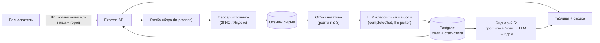

# Радар болей — архитектурный план

План эксперимента «Радар болей» (`pain-radar`): парсим отзывы с карт (Яндекс Карты, 2ГИС), отбираем негативные, выделяем «боли» пользователей (что сломано, что раздражает, чего не хватает) и считаем статистику по организациям и категориям.

Статус: **мок**. Сейчас плитка показывает дашборд v1 на демо-данных без бэкенда: вкладки «Карта болей», «Сбор», «Идеи», «История». Ниже — как превратить мок в рабочий продукт.

Разбиение предметной области на объекты (сущности, работы, правила, адаптеры) — в отдельном документе: [pain-radar-business-logic.md](pain-radar-business-logic.md).

Разбор плана и предложения (модель данных, декларация, идеи развития, состав дашборда v1) — [pain-radar-review.md](pain-radar-review.md). Пункты там пока не приняты: принятый пункт переносится сюда.

Соседний эксперимент «Радар идей» и общий слой таблиц радаров `radar_*` (ниши, регионы, анкеты, идеи) — [idea-radar-architecture.md](idea-radar-architecture.md). Общий каркас внешних источников — карты, каталоги, ленты — [collectors-architecture.md](collectors-architecture.md): сбор и троттлинг принадлежат ему, разбор боли остаётся здесь.

## Зачем: два сценария

Радар — не мониторинг репутации для бизнеса, а **разведка востребованности** для тех, кто хочет что-то построить.

### Сценарий А. Какой софт нужен в регионе

Целевая выборка — локальный бизнес: автосервисы, клиники, аптеки, строительные базы, кафе. Практическое наблюдение: ~90% негатива в отзывах — это не «плохой продукт», а **поломка коммуникации или учёта**:

- «Сказали есть по телефону, приехал — нет» → нет складского учёта / актуального наличия.
- «Не перезвонили», «телефон не отвечает» → нет CRM / приёма заявок.
- «Потеряли запись», «записан, а мастера нет» → нет системы онлайн-записи.
- «Не найти режим работы / цены» → нет актуального присутствия в сети.

Каждая повторяющаяся категория боли мапится на тип софта (см. таблицу ниже). Если в городе N автосервисов и у половины болит «потеряли запись» — это валидированная ниша для виджета записи, и **список этих автосервисов — готовая база первых клиентов** с доказанной болью.

Результат сценария А: карта болей по нише + городу, ранжированная по частоте, со списком бизнесов-носителей каждой боли.

### Сценарий Б. Генератор идей для будущего предпринимателя

Пользователь, который думает открыть своё дело, вводит профиль: образование, навыки, предпочтения, бюджет/город — и опционально игровые поля вроде гороскопа. LLM сопоставляет профиль с **реальными собранными болями региона** и выдаёт персональные идеи бизнеса, каждая из которых подкреплена цитатами-отзывами («вот 14 жалоб на доставку в вашем районе за месяц»).

Ключевое отличие от «спроси у ChatGPT идею бизнеса»: идеи опираются на свежую первичку с карт, а не на общие рассуждения модели.

### Архитектурные решения по сценариям и генерации идей

1. **Единое приложение, разные режимы/вкладки**:
   - Радар болей **НЕ делится на два разных сервиса**. Они делят 95% пайплайна (сбор, фильтрация, LLM-разметка, таксономия, общая БД).
   - **Сценарий Б (Для предпринимателей)**: основной публичный вид по умолчанию. Поиск ниши, боли клиентов, персональные идеи.
   - **Сценарий А (Для разработчиков софта / B2B-агентов)**: режим углубленного B2B-анализа (вкладка или Pro/Админ-доступ). Показывает список конкретных организаций-носителей боли, генератор оффера и готовые коммерческие предложения для отправки директорам.

2. **Кумулятивный вес идеи (от 1 отзыва до тренда)**:
   - **Даже один отзыв уже рождает идею** (гипотезу). Не нужно ждать накопления критической массы, чтобы увидеть сигнал.
   - У каждой идеи есть вычисляемый **вес (сила сигнала $W$)**:
     $$W = \sum_{i=1}^N \text{Score}_i \times e^{-\lambda \cdot \Delta t_i}$$
   - Единичный отзыв дает статус `гипотеза (W = 1)`.
   - Повторение аналогичной боли в других отзывах или организациях накладывается в тот же смысловой кластер и **наращивает вес идеи**:
     - $W = 1..2$ — «Слабый сигнал / Ранняя гипотеза»;
     - $W = 3..9$ — «Формирующаяся боль / Заметный спрос»;
     - $W \ge 10$ — «Подтвержденная системная дыра рынка».
   - Благодаря этому система полезна с первого же разобранного отзыва и органично масштабируется по мере сбора данных.


## Таксономия болей → типы софта

Фиксированные категории (чтобы складывалась статистика) и что из них следует:

| Категория боли | Примеры из отзывов | Какой софт напрашивается |
|---|---|---|
| `booking_access` — запись/доступность | «не дозвониться», «потеряли запись», «окно через 3 недели» | онлайн-запись, виджет расписания, напоминания |
| `inventory_truth` — наличие/склад | «сказали есть — приехал, нет» | складской учёт, витрина остатков, бронирование |
| `communication` — коммуникация | «не перезвонили», «в мессенджере игнор» | CRM, чат-бот приёма заявок, коллтрекинг |
| `queue_speed` — очередь/скорость | «ждала 25 минут при пустом зале» | предзаказ, электронная очередь |
| `delivery_time` — доставка/сроки | «ехало 2,5 часа вместо 40 минут» | трекинг заказа, диспетчеризация |
| `price_deception` — цена/обман | «по телефону одна цена, счёт вдвое больше» | прозрачный калькулятор, онлайн-прайс |
| `info_presence` — нет информации | «не найти телефон/режим работы» | мини-сайт, наполнение карточек на картах |
| `quality`, `staff_rudeness`, `cleanliness` | «грубят», «грязно» | слабо мапится на софт, но важно для сценария Б |
| `other` | приёмник для нового; периодически пересматриваем список | — |

По сценарию А главный сигнал — первые 7 категорий. По сценарию Б полезны все.

## Пайплайн



1. Пользователь вставляет ссылку на организацию с карт (или выбирает нишу + город — фаза 4).
2. Бэкенд запускает джобу сбора (как в `summarize`: POST создаёт джобу, клиент поллит прогресс).
3. Парсер тянет отзывы: текст, рейтинг, дата. Персональные данные автора не сохраняем.
4. Отсев негатива: рейтинг ≤ 3 из 5. Позитив и нейтраль не классифицируем — экономим LLM-вызовы.
5. LLM размечает каждый негативный отзыв: категория боли из таблицы выше, короткая формулировка («что болит»), цитата-доказательство.
6. Результаты складываем в Postgres, агрегируем: топ-боли по нише/городу, динамика по датам, список бизнесов-носителей боли.
7. UI сценария А: сводка + таблица с фильтрами (источник, категория, ниша, дата).
8. UI сценария Б: форма профиля → список идей со ссылками на боли-доказательства.

## Слои и файлы

По образцу `docs/experiments.md` и эксперимента `summarize` (долгие джобы + история):

| Слой | Файл |
|------|------|
| Страница | `public/experiments/pain-radar/index.html` (есть, мок) |
| Клиент | `public/experiments/pain-radar/pain-radar.js` |
| Стили | `public/experiments/pain-radar/pain-radar.css` |
| Роуты | `server/routes/pain-radar.js` |
| Сервисы | `server/services/pain-radar/collector.js` (джобы), `sources/twogis.js`, `sources/yandex.js`, `ideas.js` (сценарий Б) |
| LLM | общий `server/services/llm.js` через `completeChat` + `runGuarded` |
| БД | `db/migrations/0NN_pain_radar.sql` |

Внешние референсы предлагают Python (Scrapy/Playwright) — остаёмся в стеке Vesha (Node, vanilla JS), Playwright при необходимости вызываем из Node.

API-набросок (namespace `/api/pain-radar/`):

- `POST /api/pain-radar/jobs` — `{ source, url }` (позже `{ niche, city }`) → создать сбор, вернуть `jobId`.
- `GET /api/pain-radar/jobs/:id` — статус/прогресс джобы (поллинг, как summarize).
- `GET /api/pain-radar/reports/:id` — готовый отчёт: сводка + список болей.
- `GET /api/pain-radar/reports` — история отчётов пользователя/гостя.
- `GET /api/pain-radar/pains/top?city=…&niche=…` — агрегированная карта болей (сценарий А).
- `POST /api/pain-radar/ideas` — `{ profile, city, llm }` → персональные идеи бизнеса (сценарий Б).

## Источники сигналов

### Карты (основной источник)

Ни официального, ни стабильного API отзывов нет ни у Яндекса, ни у 2ГИС. Главный технический и юридический риск эксперимента.

**2ГИС (начать с него):**
- Есть официальный API каталога (фирмы, филиалы) — решает «найти организации по городу/нише».
- Отзывы официальным API не отдаются; фактически — парсинг веб-версии (внутренние JSON-endpoint'ы фронта).
- Плюс: структура отзывов проще, рейтинг и дата есть в JSON.

**Яндекс Карты:**
- Только неофициальный парсинг (внутренние endpoint'ы / SSR-данные страницы).
- Минусы: агрессивный антибот (капча, SmartCaptcha), выше шанс блокировки по IP.
- Запасной двигатель для фазы 5: headless-браузер (Playwright) — дороже по ресурсам, устойчивее к антиботу.

### Районные чаты (фаза 5+, исследовать)

Повторяющиеся вопросы в районных/городских чатах — второй тип сигнала, которого нет на картах: «кто знает телефон сантехника?», «когда дадут отопление?», «где распечатать документы прямо сейчас?». Это боли **несуществующего ещё предложения** (нет сервиса — некому поставить 1 звезду).

- Реалистичный кандидат — публичные Telegram-чаты через пользовательский API (Telethon/MTProto-аналог для Node — `gramjs`).
- Ограничения: только публичные чаты, согласие на свой аккаунт, никакой выгрузки приватных переписок; анонимизация авторов сообщений.
- Классификация той же LLM-разметкой, категории — те же + `missing_service` («услуги нет в районе вообще»).

### Общие ограничения сбора

- Уважаем ToS настолько, насколько это исследовательский эксперимент: низкая частота, кэш, без обхода капчи, без распределённого сбора.
- Rate limit на джобы через существующий guard/квоты (гость — 1–2 сбора в день).
- Персональные данные авторов не храним; для дедупликации — хэш текста.

## LLM-разметка болей

Общий блок **llm-picker** (не собираем свой выбор модели) и `completeChat` на сервере. Подходят дешёвые быстрые модели (Gemini Flash, gpt-4o-mini-класс) — задача классификации, не рассуждения.

Промпт: системный список категорий + просьба вернуть строгий JSON:

```json
{
  "pain_category": "booking_access | inventory_truth | communication | queue_speed | delivery_time | price_deception | info_presence | quality | staff_rudeness | cleanliness | missing_service | other",
  "pain_summary": "одно предложение: что болит",
  "quote": "дословная цитата из отзыва"
}
```

- Батчим: ~10 отзывов в одном вызове.
- Каждый вызов — через `runGuarded(req, task)`.
- Дёшевый старт вообще без LLM: рейтинг ≤ 3 + ключевые слова. LLM — фаза точности.

## LLM-генератор идей (сценарий Б)

Вход: профиль пользователя (`education`, `skills`, `preferences`, `budget?`, `city`, опциональные игровые поля) + топ-N болей его города/региона из нашей базы (категория, частота, примеры цитат, ниши-носители).

Промпт: «вот реальные боли региона, вот профиль человека — предложи 5 идей бизнеса/сообща, каждую привяжи к конкретным болям, укажи что нужно для старта и почему это подходит профилю». Строгий JSON-массив идей, у каждой `pain_refs` — ссылки на наши записи, чтобы в UI показать цитаты-доказательства.

Игровые поля (гороскоп и т.п.) — только как «флейвор» в формулировке ответа, не влияют на подбор болей.

## Postgres: таблицы (набросок)

```text
pain_radar_jobs
  id, user_id / guest_id, source, query_url, status, progress, created_at

pain_radar_reviews
  id, job_id, org_external_id, org_name, org_niche, city, source,
  rating, review_date, text_hash (дедупликация), raw_text

pain_radar_pains
  id, review_id, category, summary, quote, model

pain_radar_ideas
  id, user_id / guest_id, profile_json, city, ideas_json, model, created_at
```

Статистику считаем SQL-агрегацией поверх `pain_radar_pains` (топ категорий, по нишам, по городам, по датам). Отдельной таблицы статистики на MVP не нужно.

## Фазы

1. **Мок (сделано).** Плитка + дашборд v1 на демо-данных: карта болей, сбор, идеи, история. Утверждаем состав экранов и полей ([pain-radar-review.md](pain-radar-review.md), раздел Г).
2. **Один источник, одна организация.** Парсер 2ГИС по URL организации, джоба + поллинг, таблица сырых негативных отзывов без LLM (рейтинг ≤ 3). Проверяем, что парсинг вообще стабилен.
3. **LLM-разметка.** Категории болей из таксономии, сводка-топ, llm-picker на странице.
4. **Ниша + город и статистика.** Сбор по нише («автосервисы + Томск») через каталог 2ГИС, Postgres-история, агрегированная карта болей, список бизнесов-носителей → сценарий А закрыт.
5. **Генератор идей.** Форма профиля, `POST /ideas`, выдача идей с цитатами-доказательствами → сценарий Б.
6. **Второй источник и чаты.** Яндекс Карты (headless при необходимости), публичные районные Telegram-чаты как источник «несуществующего предложения».

## Открытые вопросы к обсуждению

1. **Первый источник:** согласны начать с 2ГИС (проще парсить), Яндекс — фазой 6?
2. **Ввод на MVP:** URL организации достаточно, или «ниша + город» (сценарий А) подтягиваем раньше фазы 4?
3. **Приоритет сценариев:** сначала карта болей (А), потом генератор идей (Б) — или Б интереснее и его стоит сделать раньше, на моковых болях?
4. **Хранение сырого текста отзыва:** ок ли хранить полный текст (нужен для цитат) или режем до цитаты из-за авторских прав?
5. **Районные чаты:** легально/этично ли для нас читать публичные Telegram-чаты района со своего аккаунта? Нужен ли этот источник вообще, или карт достаточно?
6. **Гость vs логин:** квота гостю 1 сбор в день, полная история только залогиненному — как в summarize/podborka?
