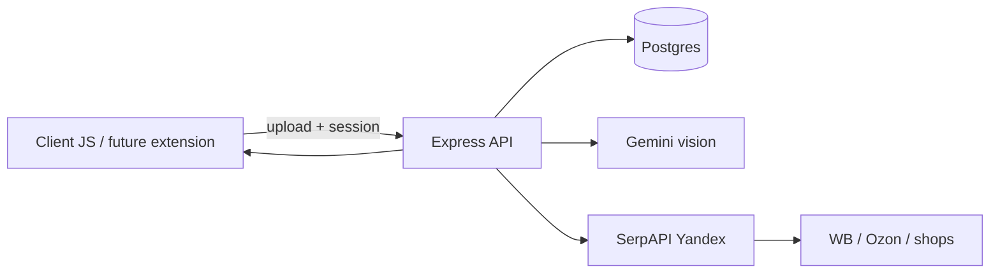

# Подборка одежды — архитектурный план

План эксперимента «Подборка одежды»: клиентский JS (задел под browser extension), Express API с Postgres, vision→поиск по RU-маркетплейсам, гостевой режим с лимитами плюс email/пароль и Google OAuth.

## Контекст

Сейчас Vesha — тонкий Express + статика (`main.js`, `public/experiments/`). БД, auth и AI ещё нет. Карточка-заглушка `draft` переименовывается в эксперимент **«Подборка одежды»** (`podborka`).

**MVP-рынок:** Россия / СНГ (Яндекс → ссылки на WB, Ozon и др.). Международный поиск — фаза 2.

**Клиент vs сервер:** UI и будущая логика расширения — JS на клиенте. Секреты (AI, поиск, OAuth) и БД — только на бэкенде. Клиент не держит API-ключи.



## Пайплайн MVP

1. Пользователь загружает фото вещи (гость или аккаунт).
2. Бэкенд сохраняет файл/метаданные, создаёт `look`.
3. Vision-модель описывает вещь в структурированный JSON (тип, цвет, крой, материал, бренд если видно, пол, стиль, ключевые признаки).
4. Из JSON собираются 1–3 поисковых запроса на русском.
5. Поиск через **SerpAPI `engine=yandex`** (запросы вида `купить … site:wildberries.ru` / `site:ozon.ru` + общий Яндекс).
6. Офферы нормализуются, сохраняются, отдаются клиенту карточками (title, price, shop, url, thumbnail, score).

Гость: N загрузок / день (например 3) и урезанный список офферов. Залогиненный — выше лимит и полная выдача.

## ИИ и модели (изображения)

| Роль | Провайдер / модель | Зачем |
|------|-------------------|--------|
| Основной vision | **Google Gemini 3.5 Flash** (fallback: 3.5 Flash-Lite / flash-latest) | Дешёвый мультимодал: описание одежды + строгий JSON |
| Fallback vision | **OpenAI gpt-4o** | Если Gemini недоступен / слабый ответ |
| Текстовый реранк (позже) | Gemini Flash или gpt-4o-mini | Сверка офферов с исходным описанием |

Обращение к моделям — только с сервера (`GEMINI_API_KEY`, `OPENAI_API_KEY`). Промпт фиксирует схему ответа (категория, цвета, паттерн, бренд, search_queries[]).

Обратный image-search (Yandex Images / Lens) — не в MVP; добавляем после текстового поиска по атрибутам.

Поиск MVP: **прямой WB search** (публичный `search.wb.ru`, детальные query) + fallback SerpAPI Yandex (Ozon/web) при пустой выдаче. Ozon прямым API пока не трогаем.

## Auth

- **Гость:** подписанный cookie (`guest_id` + HMAC), таблица квот.
- **Email/пароль:** регистрация/логин, `password_hash` (bcrypt/argon2), сессии в БД (cookie session id).
- **Google OAuth:** `GOOGLE_CLIENT_ID/SECRET`, callback на бэкенд, связка через `auth_identities`.

Один пользователь может иметь и пароль, и Google. Расширение позже будет ходить в те же API с cookie/token.

## Postgres: таблицы

```text
users
  id, email (unique, nullable for pure-oauth edge), display_name,
  password_hash (nullable), created_at, updated_at

auth_identities
  id, user_id → users, provider ('google'|'password'),
  provider_subject (google sub / email), meta jsonb, unique(provider, provider_subject)

sessions
  id, user_id → users, token_hash, expires_at, created_at, user_agent, ip

guests
  id (uuid), created_at, last_seen_at

usage_quotas
  id, subject_type ('guest'|'user'), subject_id, day (date),
  uploads_count, searches_count, unique(subject_type, subject_id, day)

looks
  id, user_id nullable, guest_id nullable, status ('uploaded'|'analyzing'|'ready'|'failed'),
  title nullable, created_at, updated_at

look_images
  id, look_id → looks, storage_path, mime, width, height, bytes, created_at

ai_extractions
  id, look_id → looks, provider, model, raw_response jsonb,
  attributes jsonb, search_queries text[], created_at

search_jobs
  id, look_id → looks, provider ('serpapi_yandex'), query, status,
  raw_response jsonb, error text, created_at, finished_at

offers
  id, look_id → looks, search_job_id → search_jobs,
  shop ('wildberries'|'ozon'|'other'), title, url, price_cents, currency,
  thumbnail_url, snippet, score real, created_at
```

Индексы: `looks(user_id)`, `looks(guest_id)`, `offers(look_id)`, `sessions(token_hash)`, `usage_quotas(subject…, day)`.

Картинки на MVP — локально в `uploads/` (gitignore); позже S3-совместимое хранилище.

## Структура кода

- Переименовать `public/experiments/draft/` → `podborka`, обновить `registry.json`: title **«Подборка одежды»**, tech `['js','vision','postgres']`.
- Расширить Express: роуты `/api/auth/*`, `/api/looks`, `/api/looks/:id/search`.
- Добавить: `pg`, миграции SQL в `db/migrations/`, dotenv, multer (upload), bcrypt, cookie-session или собственные session cookies, google-auth.
- Клиент эксперимента: upload → статус look → список офферов (чистый JS, без фреймворка — проще перенос в extension).

## Фазы работ

1. **Каркас:** rename эксперимента, Postgres + миграции, env-шаблон.
2. **Auth:** guest cookie, email/пароль, Google OAuth, квоты.
3. **Look pipeline:** upload → Gemini extraction → SerpAPI Yandex → `offers`.
4. **UI MVP:** одна страница эксперимента с загрузкой и результатами.
5. **Позже:** реранк офферов, image-search, intl (Google), упаковка в Chrome extension на том же API.

## Env (секреты)

`DATABASE_URL`, `SESSION_SECRET`, `GEMINI_API_KEY`, `OPENAI_API_KEY` (fallback), `SERPAPI_API_KEY`, `GOOGLE_CLIENT_ID`, `GOOGLE_CLIENT_SECRET`, `GOOGLE_CALLBACK_URL`, лимиты гостя (`GUEST_UPLOADS_PER_DAY=3`).
